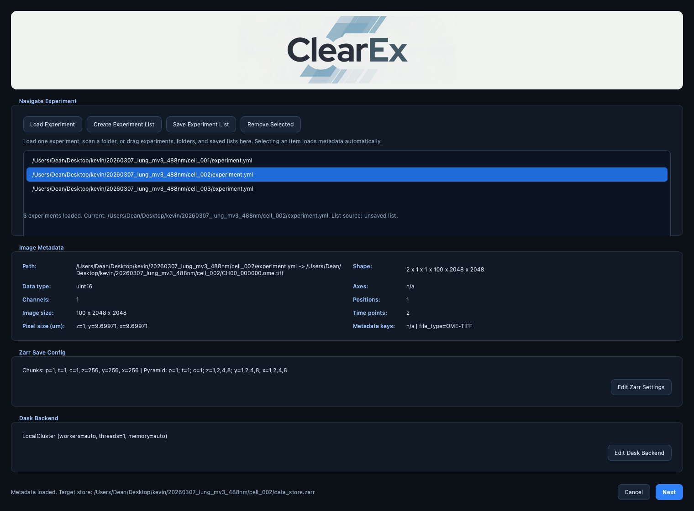

CLI and Execution Modes
=======================

Command Surface
---------------

ClearEx installs the ``clearex`` command.

Current primary arguments are:

- ``--flatfield``
- ``--deconvolution``
- ``--particle-detection``
- ``--usegment3d``
- ``--channel-indices``
- ``--input-resolution-level``
- ``--shear-transform``
- ``--registration``
- ``--fusion``
- ``--display-pyramid``
- ``--visualization``
- ``--render-movie``
- ``--compile-movie``
- ``--mip-export``
- ``--file``
- ``--migrate-store``
- ``--migrate-output``
- ``--migrate-overwrite``
- ``--dask`` / ``--no-dask``
- ``--chunks``
- ``--stage-axis-map``
- ``--gui`` / ``--no-gui``
- ``--headless``

Execution Modes
---------------

The entrypoint is GUI-first by default:

- ``clearex`` attempts GUI launch.
- ``--headless`` forces non-interactive mode.
- ``--no-gui`` disables GUI launch attempts.
- GUI launch failures (missing display/runtime issues) fall back to headless
  mode with warnings.

GUI Setup Flow
--------------

The first GUI window is an experiment-list driven setup flow:

- ``Load Experiment`` adds one Navigate ``experiment.yml``/``experiment.yaml``.
- ``Create Experiment List`` can either:
  - recursively scan a folder for Navigate experiment descriptors, or
  - reload a saved ClearEx list file (``.clearex-experiment-list.json``).
- Drag and drop accepts individual experiment descriptors, folders to scan,
  and saved list files.
- Selecting an entry in the list automatically loads the metadata panel.
- Double-clicking a list item reloads that experiment's metadata explicitly.
- The current ordered list can be saved back to a reusable
  ``.clearex-experiment-list.json`` file.
- ``Spatial Calibration`` edits store-level world ``z/y/x`` placement mapping
  for the currently selected experiment without rewriting image data.
- Spatial-calibration drafts are tracked per experiment while setup is open.
- Existing canonical stores prefill the spatial-calibration control when
  metadata is already present.
- Pressing ``Next`` batch-prepares canonical ``data_store.ome.zarr`` stores for
  every listed experiment that is missing a complete store, persists the
  resolved spatial calibration to every reused or newly prepared store, then
  opens analysis selection for the currently selected experiment.
- ``Rebuild Canonical Store`` forces the listed stores to be rebuilt as
  canonical OME-Zarr outputs with the current chunk and pyramid settings.

   Setup dialog with the experiment list pane, automatic metadata loading, and
   themed list-management controls.

Workflow Selection
------------------

Each analysis flag is independent. You can run a single operation or multiple
operations in one run.

In the GUI analysis window:

- ``Analysis Scope`` lets you choose which loaded ``experiment.yml`` is the
  active analysis target.
- Enabling the batch checkbox runs the same selected operation set across all
  experiments from the setup list instead of only the selected one.
- Per-dataset analysis widget state is restored automatically when available:
  saved GUI state is preferred, and ``Restore Latest Run Parameters`` falls
  back to the latest completed provenance-backed run for the active store.

Examples
--------

.. code-block:: bash

   # GUI-first default
   clearex

.. code-block:: bash

   # Headless chained run
   clearex --headless \
     --file /path/to/experiment.yml \
     --flatfield --deconvolution --particle-detection

.. code-block:: bash

   # Headless visualization against an existing canonical OME-Zarr store
   clearex --headless \
     --file /path/to/data_store.ome.zarr \
     --visualization

.. code-block:: bash

   # Headless movie workflow against an existing canonical OME-Zarr store
   clearex --headless \
     --file /path/to/data_store.ome.zarr \
     --render-movie

   clearex --headless \
     --file /path/to/data_store.ome.zarr \
     --compile-movie

.. code-block:: bash

   # Headless Navigate run with explicit stage-to-world placement mapping
   clearex --headless \
     --file /path/to/experiment.yml \
     --visualization \
     --stage-axis-map z=+x,y=none,x=+y

.. code-block:: bash

   # Migrate one legacy ClearEx store
   clearex --migrate-store /path/to/legacy_store.zarr

Spatial Calibration
-------------------

Spatial calibration is a store-level mapping from world ``z/y/x`` placement
axes to Navigate multiposition stage coordinates.

- Canonical text form is ``z=...,y=...,x=...``.
- Allowed bindings are ``+x``, ``-x``, ``+y``, ``-y``, ``+z``, ``-z``,
  ``+f``, ``-f``, and ``none``.
- Default identity mapping is ``z=+z,y=+y,x=+x``.
- ``none`` disables translation on that world axis.
- ``THETA`` remains interpreted as rotation of the ``z/y`` plane about world
  ``x``.

GUI and headless flows share the same normalized parser and storage policy:

- GUI setup writes the resolved mappings to the listed experiment stores on
  ``Next``.
- ``--stage-axis-map`` writes an explicit override to Navigate-materialized
  stores and existing canonical OME-Zarr stores before analysis starts.
- If no explicit override is supplied, existing store calibration is preserved.
- The mapping changes placement metadata only; image payloads remain unchanged.

Interchangeable Routine Composition
-----------------------------------

In orchestration, routines are composed from normalized
``analysis_parameters`` rather than hard-coded fixed order:

- ``execution_order`` decides sequence among selected routines.
- ``input_source`` decides which logical upstream component each routine reads.
- ``force_rerun`` can override provenance-based skip behavior.

This allows operators to rerun one stage, swap stage order, or run partial
chains without changing the code path in ``main.py``.

``registration`` and ``fusion`` are intentionally split so operators can run
transform estimation and final stitched rendering in separate executions with
different backend sizing or worker-memory limits.

Input Source Resolution
-----------------------

Runtime source aliases currently include:

- ``data`` -> ``clearex/runtime_cache/source/data``
- ``flatfield`` -> ``clearex/runtime_cache/results/flatfield/latest/data``
- ``deconvolution`` -> ``clearex/runtime_cache/results/deconvolution/latest/data``
- ``shear_transform`` -> ``clearex/runtime_cache/results/shear_transform/latest/data``
- ``fusion`` -> ``clearex/runtime_cache/results/fusion/latest/data``
- ``usegment3d`` -> ``clearex/runtime_cache/results/usegment3d/latest/data``
- ``registration`` -> ``clearex/results/registration/latest`` (metadata-only;
  consumed by ``fusion``)
- ``visualization`` -> ``clearex/results/visualization/latest`` (metadata-only;
  consumed by ``render_movie``)
- ``render_movie`` -> ``clearex/results/render_movie/latest`` (metadata-only;
  consumed by ``compile_movie``)
- ``compile_movie`` -> ``clearex/results/compile_movie/latest`` (metadata-only;
  terminal export metadata)

Public OME image collections at the root and under ``results/<analysis>/latest``
exist for interoperability and visualization. Analysis kernels should not write
into those public arrays directly.

When a requested source component does not exist, runtime raises an input
dependency error instead of silently falling back.

Progress and Run Lifecycle
--------------------------

Execution progresses through these coarse stages:

1. Resolve workflow and inputs.
2. Materialize canonical OME-Zarr store when needed.
3. Execute selected analyses in resolved order.
4. Publish latest outputs and append provenance run record.

GUI execution uses explicit progress callbacks and per-run logging in the
resolved workflow log directory.

The ``Running Analysis`` dialog also includes a ``Stop Analysis`` button.
Cancellation is cooperative: ClearEx stops at the next progress checkpoint and
persists the interrupted run in provenance with ``status=cancelled``.

Visualization Keyframe Capture
------------------------------

When visualization launches napari, keyframe capture is enabled by default:

- Press ``K`` to capture a keyframe.
- Press ``Shift-K`` to remove the most recent keyframe.

The keyframe manifest path defaults to:

- ``<analysis_store>/clearex/results/visualization/latest/keyframes.json``

and can be overridden with ``keyframe_manifest_path`` in visualization
parameters.

Each keyframe stores enough state to recreate the current scene for movie
generation, including:

- camera values (angles, zoom, center, perspective),
- dims state (current step, axis labels, order, and 2D/3D mode),
- layer order and selected/active layers,
- per-layer display configuration (visibility, LUT/colormap, rendering mode,
  blending, opacity, contrast, and transforms when available).

The GUI provides a popup editor (``Layer/View Table...``) for optional
per-layer overrides with columns:

- ``Layer``, ``Visible``, ``LUT/Colormap``, ``Rendering``, ``Annotation``.

Movie Rendering and Compilation
-------------------------------

ClearEx now separates movie generation into two explicit operations:

- ``render_movie``:
  reconstructs the visualization scene from the keyframe manifest and renders
  PNG frames for one or more selected resolution levels.
- ``compile_movie``:
  validates one rendered frame set and encodes it through ``ffmpeg`` into MP4,
  ProRes MOV, or both.

Runtime storage:

- ``render_movie`` latest metadata:
  - ``clearex/results/render_movie/latest``
- ``compile_movie`` latest metadata:
  - ``clearex/results/compile_movie/latest``
- Default in-store artifacts:
  - ``<analysis_store>/clearex/results/visualization/latest/keyframes.json``
  - ``<analysis_store>/clearex/results/render_movie/latest/render_manifest.json``
  - ``<analysis_store>/clearex/results/render_movie/latest/level_<nn>_frames/frame_000000.png``
  - ``<analysis_store>/clearex/results/compile_movie/latest/*.mp4``
  - ``<analysis_store>/clearex/results/compile_movie/latest/*.mov``
- Override note:
  - ``output_directory`` can still redirect ``render_movie`` or
    ``compile_movie`` to an external export tree when desired.

Practical guidance:

- Use coarse levels such as ``[1]`` or ``[2]`` plus moderate frame sizes for
  preview renders.
- Use level ``0`` and the final frame size for publication renders.
- `default_transition_frames` around ``48`` is a good default for smooth
  motion.
- ``mp4_crf`` in the ``16`` to ``24`` range is a reasonable review/final
  quality band, with lower values trading size for quality.
- Rebuild timing and codec settings with ``compile_movie`` first, because it is
  much faster than rerendering napari screenshots.

Captured napari ``Points`` and ``Tracks`` layers are serialized into the
keyframe manifest and rebuilt during ``render_movie`` so common particle/track
overlays can survive beyond the interactive session.

``render_movie`` now captures from a visible napari viewer by default.
This avoids the empty-frame failures seen with hidden/offscreen capture while
keeping CPU/software rendering and GPU-backed rendering usable.
When ClearEx is already running inside a Qt GUI, the visible movie-capture
viewer is launched in a dedicated subprocess so rendering does not touch Qt
or OpenGL from the GUI worker thread.

The CLI currently exposes ``--render-movie`` and ``--compile-movie`` as
operation flags. Detailed movie parameter editing is currently done through the
GUI or a programmatic ``WorkflowConfig.analysis_parameters`` payload.
